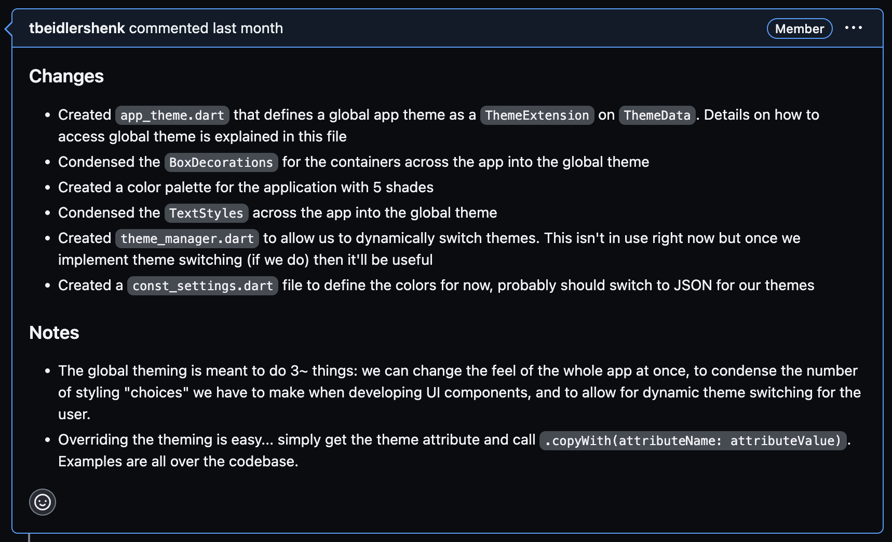

## Creating a PR
1. Link the pull request with the associated issue(s)
2. Tag reviewers (either ```@jeffzheng13``` or ```@tbeidlershenk``` depending on the issue)
3. Write a bulleted summary of the changes made

## Example PR

Any specific design choices that might not be immediately clear as to why it was done in a certain way can be documented in a Notes section as shown in the image above.

## Creating Issues
1. Document the issue to be fixed / feature to be implemented
2. Tag the issue with the appropriate labels **(feature, enhancement, structural, bug, etc.)**
3. Add any thoughts / resources you have that might help with getting started on the issue

## Project Structure
```
├── authentication
│   ├── User data model
│   ├── Loading animations
│   ├── Auth service class
├── cards
│   ├── Reused custom widgets
├── data
│   ├── Firebase data models
├── pages
│   ├── Login / Signup pages
│   ├── Map view
│   ├── List view
│   ├── Individual post overlay
│   ├── New post overlay
├── routing
│   ├── Custom navigation widget
│   ├── Routing functions
├── themes 
│   ├── App theme data
│   ├── Theme manager class
├── firebase_options.dart
├── main.dart
└── utils.dart
```

## Using Defined Themes
There is a global app theme class ```AppTheme``` that can be accessed & added to as needed.
```Dart
/* Getting the theme with BuildContext */
final theme = Theme.of(context).extension<AppTheme>()!;

/* Theme attributes can be accessed directly */
decoration: theme.cardBodyDecoration
textStyle: theme.headerStyle

/* Overriding a theme attribute */
textStyle: theme.headerStyle.copyWith(fontWeight: FontWeight.bold)
```
Use the text styles, app colors, and container decorations defined in AppTheme as much as possible in order for the whole app to have the same flavor. It also makes it easy to tweak the styling in the AppTheme class and have the changes reflected throughout the entire app.

## Running using dev database
```Bash
# Set up your launch.json file with the appropriate configuration

"name": "Flutter (Chrome)",
"program": "lib/main.dart",
"deviceId": "chrome",
"request": "launch",
"type": "dart",
"args": [
    "--web-port",
    "65459",
    "--dart-define=\"MODE=development\""
]

# Or run via command line
flutter run -d chrome --web-port 65459 --dart-define="MODE=development"
```

## Resources
1. [Flutter Widget Library](https://docs.flutter.dev/ui/widgets)
2. [Dart documentation](https://dart.dev/guides)
